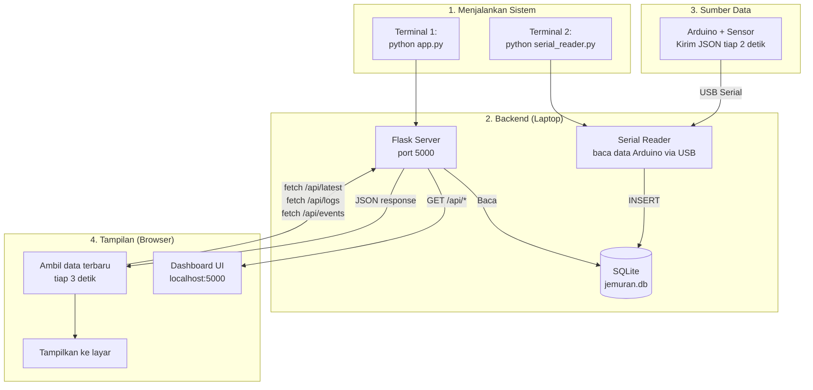
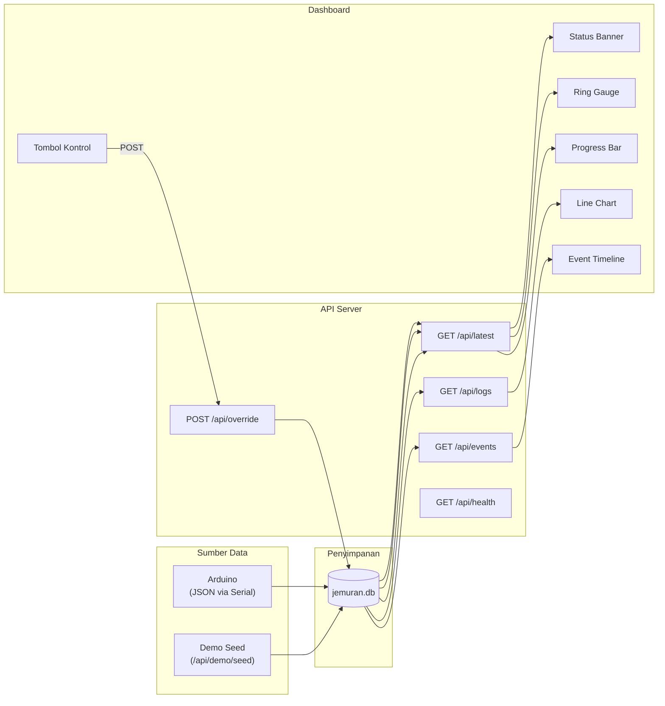
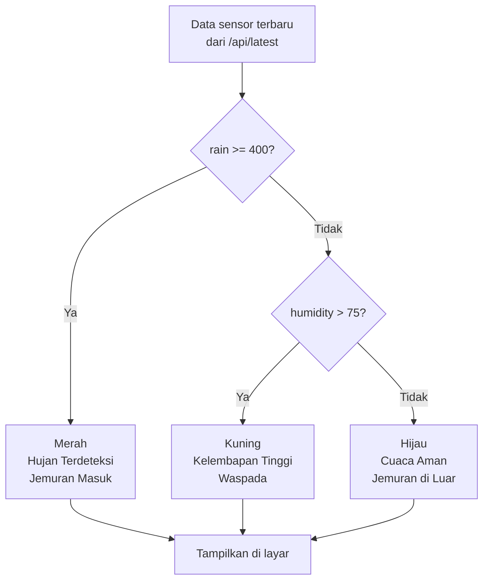
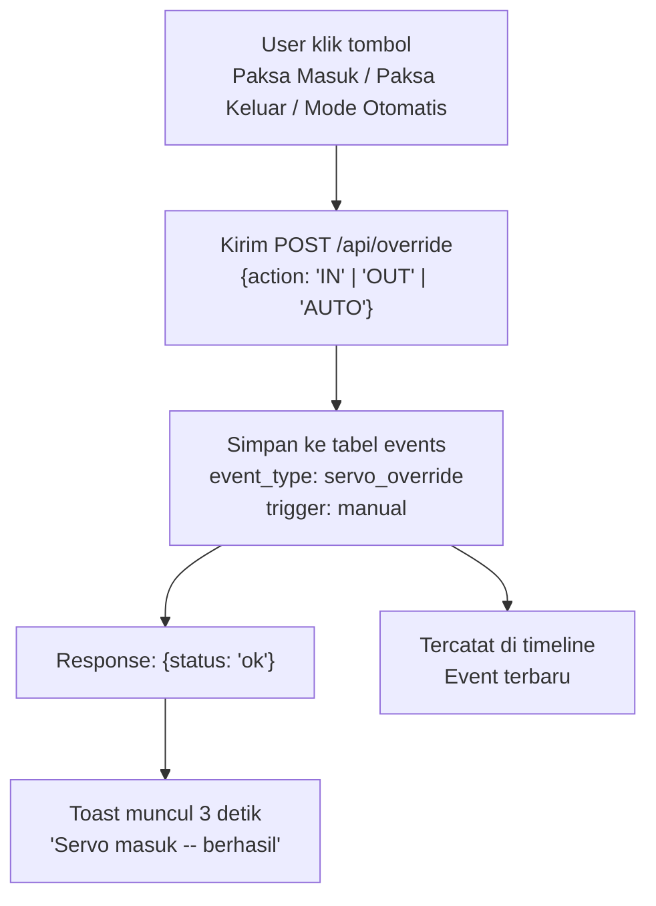
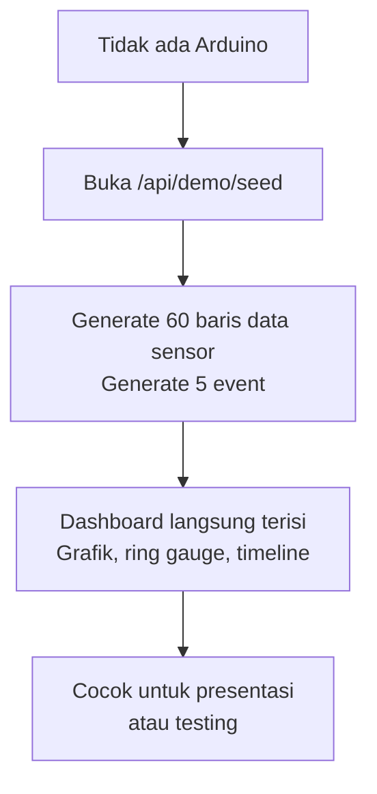
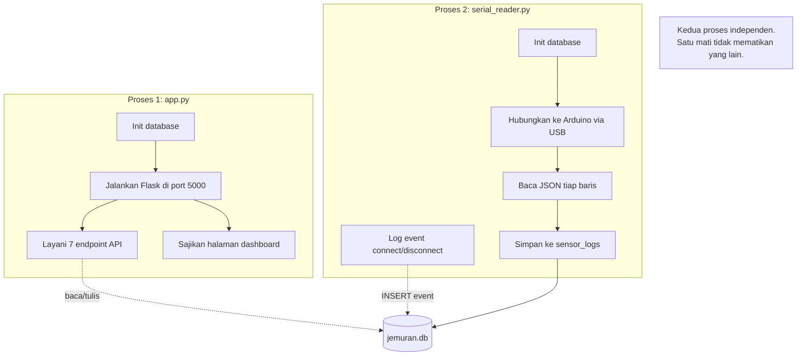

# Diagram Alur -- Jemuran Dashboard

Diagram berikut menjelaskan cara kerja sistem dari sisi software.

---

## Alur Utama

---

## Alur Data Detail

---

## Alur Status Banner

---

## Alur Manual Override

---

## Alur Demo Mode

---

## Dua Proses Berjalan Bersamaan

---

## Catatan

- Semua diagram menggunakan [Mermaid](https://mermaid.js.org). GitHub akan merender diagram ini langsung di halaman repo.
- Buka `FLOWCHART.md` di GitHub untuk melihat diagram dalam bentuk visual.
