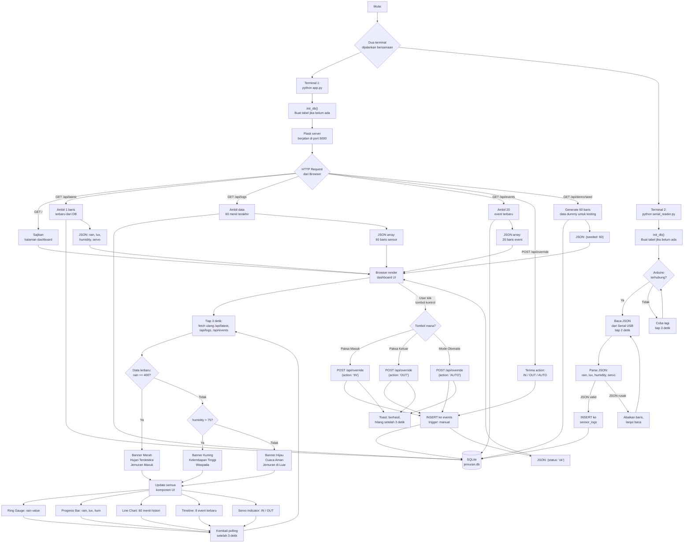

# Diagram Alur -- Jemuran Dashboard

Diagram berikut menjelaskan keseluruhan cara kerja sistem dalam satu alur terpadu.

---

## Cara Membaca Diagram

Diagram dibaca dari atas ke bawah, dibagi menjadi beberapa zona:

| Zona | Warna | Isi |
|------|-------|-----|
| Startup | Node atas | Dua terminal, init database |
| Data Masuk | Kiri | Arduino -> serial_reader -> SQLite |
| API Server | Tengah | Flask melayani 7 endpoint |
| Browser | Kanan | Dashboard polling + render UI |
| Kontrol | Bawah kanan | User override via tombol |
| Status | Tengah bawah | Decision tree: rain dan humidity |

Panah menunjukkan arah aliran data. Kotak belah ketupat adalah titik keputusan (if/else). Silinder adalah database.
